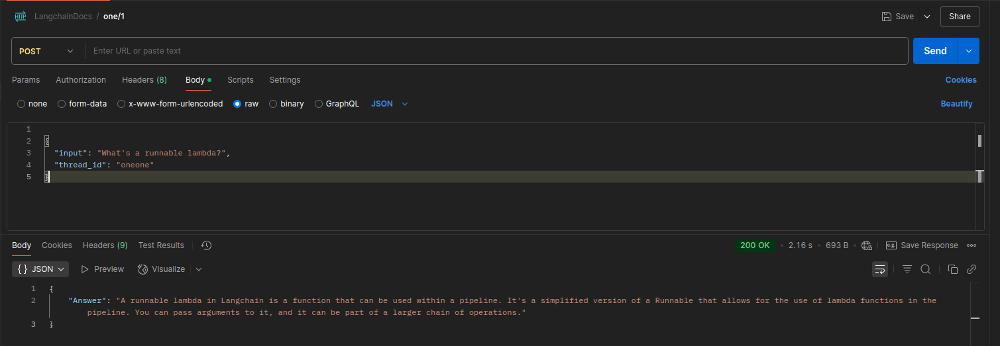
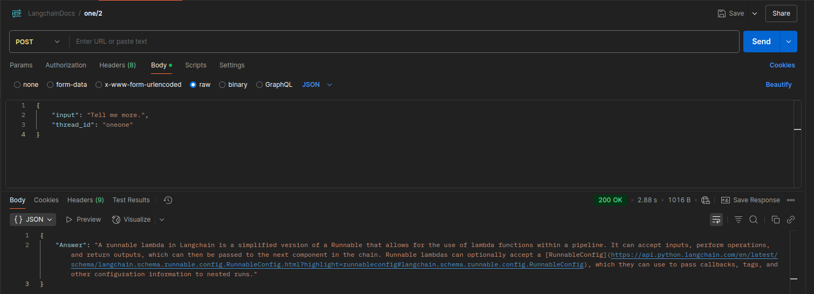
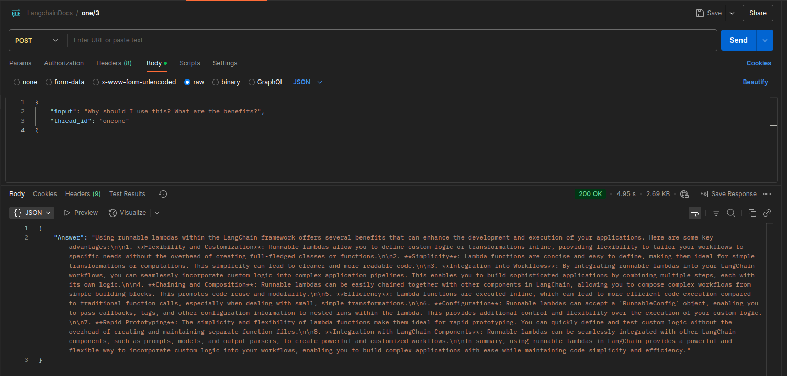

# Interactive Retriever - Customer Support Automation

## README outline

- README outline
- Main goals
- Task Outline
- Solution Description
  - Approaches
  - Technologies
- Results
  - BM25 results
  - Parent-Child results
- Installation
  - Experiments notebook setup
  - AWS Knowledge base setup
  - AWS Lambda setup
- Lambda function Postman API example

## Main goals

- Experimenting with different RAG approaches to find the best answer generation performance on the Question - Answer dataset: [LangChain Docs Q&A](https://langchain-ai.github.io/langchain-benchmarks/notebooks/retrieval/comparing_techniques.html#benchmark-tasks-and-datasets-as-of-2023-11-21).

- Interactive retriever: setting up a Chatbot with history and RAG over the LangChain documentation that can be called through a Lambda function.

## Task specification

1. Preparations:
    - Choose embedding and text gen models from Bedrock.

    - Create AWS cost estimation.

    - Explore Advanced RAG techniques: choose 2 other retrievers while taking into considerations the features of the dataset.

    - Check Ragas and Langsmith for evaluation techniques and metrics, choose 5 for validation.

2. RAG experimentation:

    - Implement ingestion and inference pipeline for the selected 3 RAG techniques locally.

    - Compare the results and choose the best for this use case.

3. Cloud deployment:

    - Create ingestion pipeline to AWS Knowledge Base and ingest the data.

    - Setup S3 as persistent memory storage.

    - Implement Lambda Function.

## Solution Description

### Approaches

- Three different RAG sub-techniques

- Chat history implementation with the AWS Converse API over a Lambda function

- Query rewriting for naive retriever in AWS Knowledge Base

---

### Technologies

- Cloud: AWS Bedrock
    - LLM: Amazon Nova Micro for question answering, Anthropic Claude 3.5 Sonnet for Query rewriting
    - Embedding Model: Amazon Titan Text Embeddings V2

- RAG approaches
    - Naive retriever with Pinecone
    - Custom Parent-Child retriever with Pinecone
    - BM25 from Langchain

- Evaluation
    - Ragas metrics
        - ContextPrecision
        - ContextRecall
        - Faithfulness
        - BLUE
        - ROUGE

- AWS Lambda
    - Retrieval with AWS Knowledge Base using naive Pinecone
    - Data stored on S3
    - Chat history managed with Converse API

## Results

Among the RAG approaches investigated, the Parent-Child retriever outperformed the other two on the benchmarked metrics, balanced by its higher complexity.

BM25 offers very fast initialization and query time, but with 20% lower retrieval accuracy compared to Parent-Child.

### Optuna grid parameter search results

#### BM25 results

<table id="T_3071a">
  <thead>
    <tr>
      <th class="blank level0" >&nbsp;</th>
      <th id="T_3071a_level0_col0" class="col_heading level0 col0" >k1</th>
      <th id="T_3071a_level0_col1" class="col_heading level0 col1" >b</th>
      <th id="T_3071a_level0_col2" class="col_heading level0 col2" >epsilon</th>
      <th id="T_3071a_level0_col3" class="col_heading level0 col3" >top_k</th>
      <th id="T_3071a_level0_col4" class="col_heading level0 col4" >ContextPrecision</th>
      <th id="T_3071a_level0_col5" class="col_heading level0 col5" >ContextRecall</th>
      <th id="T_3071a_level0_col6" class="col_heading level0 col6" >Faithfulness</th>
      <th id="T_3071a_level0_col7" class="col_heading level0 col7" >Blue</th>
      <th id="T_3071a_level0_col8" class="col_heading level0 col8" >Rouge</th>
    </tr>
  </thead>
  <tbody>
    <tr>
      <th id="T_3071a_level0_row0" class="row_heading level0 row0" >0</th>
      <td id="T_3071a_row0_col0" class="data row0 col0" >1.300000</td>
      <td id="T_3071a_row0_col1" class="data row0 col1" >0.500000</td>
      <td id="T_3071a_row0_col2" class="data row0 col2" >0.250000</td>
      <td id="T_3071a_row0_col3" class="data row0 col3" >3</td>
      <td id="T_3071a_row0_col4" class="data row0 col4" >0.645604</td>
      <td id="T_3071a_row0_col5" class="data row0 col5" >0.725484</td>
      <td id="T_3071a_row0_col6" class="data row0 col6" >0.620222</td>
      <td id="T_3071a_row0_col7" class="data row0 col7" >0.099129</td>
      <td id="T_3071a_row0_col8" class="data row0 col8" >0.189244</td>
    </tr>
    <tr>
      <th id="T_3071a_level0_row1" class="row_heading level0 row1" >1</th>
      <td id="T_3071a_row1_col0" class="data row1 col0" >1.300000</td>
      <td id="T_3071a_row1_col1" class="data row1 col1" >0.500000</td>
      <td id="T_3071a_row1_col2" class="data row1 col2" >0.250000</td>
      <td id="T_3071a_row1_col3" class="data row1 col3" >5</td>
      <td id="T_3071a_row1_col4" class="data row1 col4" >0.651252</td>
      <td id="T_3071a_row1_col5" class="data row1 col5" >0.757625</td>
      <td id="T_3071a_row1_col6" class="data row1 col6" >0.576593</td>
      <td id="T_3071a_row1_col7" class="data row1 col7" >0.119858</td>
      <td id="T_3071a_row1_col8" class="data row1 col8" >0.190237</td>
    </tr>
    <tr>
      <th id="T_3071a_level0_row2" class="row_heading level0 row2" >2</th>
      <td id="T_3071a_row2_col0" class="data row2 col0" >1.300000</td>
      <td id="T_3071a_row2_col1" class="data row2 col1" >0.700000</td>
      <td id="T_3071a_row2_col2" class="data row2 col2" >0.250000</td>
      <td id="T_3071a_row2_col3" class="data row2 col3" >3</td>
      <td id="T_3071a_row2_col4" class="data row2 col4" >0.631868</td>
      <td id="T_3071a_row2_col5" class="data row2 col5" >0.719804</td>
      <td id="T_3071a_row2_col6" class="data row2 col6" >0.558512</td>
      <td id="T_3071a_row2_col7" class="data row2 col7" >0.095685</td>
      <td id="T_3071a_row2_col8" class="data row2 col8" >0.187126</td>
    </tr>
    <tr>
      <th id="T_3071a_level0_row3" class="row_heading level0 row3" >3</th>
      <td id="T_3071a_row3_col0" class="data row3 col0" >1.300000</td>
      <td id="T_3071a_row3_col1" class="data row3 col1" >0.700000</td>
      <td id="T_3071a_row3_col2" class="data row3 col2" >0.250000</td>
      <td id="T_3071a_row3_col3" class="data row3 col3" >5</td>
      <td id="T_3071a_row3_col4" class="data row3 col4" >0.631426</td>
      <td id="T_3071a_row3_col5" class="data row3 col5" >0.795937</td>
      <td id="T_3071a_row3_col6" class="data row3 col6" >0.603476</td>
      <td id="T_3071a_row3_col7" class="data row3 col7" >0.113690</td>
      <td id="T_3071a_row3_col8" class="data row3 col8" >0.189978</td>
    </tr>
    <tr>
      <th id="T_3071a_level0_row4" class="row_heading level0 row4" >4</th>
      <td id="T_3071a_row4_col0" class="data row4 col0" >1.300000</td>
      <td id="T_3071a_row4_col1" class="data row4 col1" >0.700000</td>
      <td id="T_3071a_row4_col2" class="data row4 col2" >0.250000</td>
      <td id="T_3071a_row4_col3" class="data row4 col3" >10</td>
      <td id="T_3071a_row4_col4" class="data row4 col4" >0.601835</td>
      <td id="T_3071a_row4_col5" class="data row4 col5" >0.824621</td>
      <td id="T_3071a_row4_col6" class="data row4 col6" >0.607423</td>
      <td id="T_3071a_row4_col7" class="data row4 col7" >0.158535</td>
      <td id="T_3071a_row4_col8" class="data row4 col8" >0.212955</td>
    </tr>
    <tr>
      <th id="T_3071a_level0_row5" class="row_heading level0 row5" >5</th>
      <td id="T_3071a_row5_col0" class="data row5 col0" >1.300000</td>
      <td id="T_3071a_row5_col1" class="data row5 col1" >0.900000</td>
      <td id="T_3071a_row5_col2" class="data row5 col2" >0.250000</td>
      <td id="T_3071a_row5_col3" class="data row5 col3" >3</td>
      <td id="T_3071a_row5_col4" class="data row5 col4" >0.623626</td>
      <td id="T_3071a_row5_col5" class="data row5 col5" >0.666279</td>
      <td id="T_3071a_row5_col6" class="data row5 col6" >0.482375</td>
      <td id="T_3071a_row5_col7" class="data row5 col7" >0.095501</td>
      <td id="T_3071a_row5_col8" class="data row5 col8" >0.204845</td>
    </tr>
    <tr>
      <th id="T_3071a_level0_row6" class="row_heading level0 row6" >6</th>
      <td id="T_3071a_row6_col0" class="data row6 col0" >1.300000</td>
      <td id="T_3071a_row6_col1" class="data row6 col1" >0.900000</td>
      <td id="T_3071a_row6_col2" class="data row6 col2" >0.250000</td>
      <td id="T_3071a_row6_col3" class="data row6 col3" >5</td>
      <td id="T_3071a_row6_col4" class="data row6 col4" >0.613599</td>
      <td id="T_3071a_row6_col5" class="data row6 col5" >0.720058</td>
      <td id="T_3071a_row6_col6" class="data row6 col6" >0.571203</td>
      <td id="T_3071a_row6_col7" class="data row6 col7" >0.111747</td>
      <td id="T_3071a_row6_col8" class="data row6 col8" >0.202184</td>
    </tr>
    <tr>
      <th id="T_3071a_level0_row7" class="row_heading level0 row7" >7</th>
      <td id="T_3071a_row7_col0" class="data row7 col0" >1.500000</td>
      <td id="T_3071a_row7_col1" class="data row7 col1" >0.500000</td>
      <td id="T_3071a_row7_col2" class="data row7 col2" >0.250000</td>
      <td id="T_3071a_row7_col3" class="data row7 col3" >3</td>
      <td id="T_3071a_row7_col4" class="data row7 col4" >0.642857</td>
      <td id="T_3071a_row7_col5" class="data row7 col5" >0.722255</td>
      <td id="T_3071a_row7_col6" class="data row7 col6" >0.679987</td>
      <td id="T_3071a_row7_col7" class="data row7 col7" >0.112833</td>
      <td id="T_3071a_row7_col8" class="data row7 col8" >0.187256</td>
    </tr>
    <tr>
      <th id="T_3071a_level0_row8" class="row_heading level0 row8" >8</th>
      <td id="T_3071a_row8_col0" class="data row8 col0" >1.500000</td>
      <td id="T_3071a_row8_col1" class="data row8 col1" >0.500000</td>
      <td id="T_3071a_row8_col2" class="data row8 col2" >0.250000</td>
      <td id="T_3071a_row8_col3" class="data row8 col3" >5</td>
      <td id="T_3071a_row8_col4" class="data row8 col4" >0.649939</td>
      <td id="T_3071a_row8_col5" class="data row8 col5" >0.765873</td>
      <td id="T_3071a_row8_col6" class="data row8 col6" >0.631159</td>
      <td id="T_3071a_row8_col7" class="data row8 col7" >0.120628</td>
      <td id="T_3071a_row8_col8" class="data row8 col8" >0.190556</td>
    </tr>
    <tr>
      <th id="T_3071a_level0_row9" class="row_heading level0 row9" >9</th>
      <td id="T_3071a_row9_col0" class="data row9 col0" >1.500000</td>
      <td id="T_3071a_row9_col1" class="data row9 col1" >0.700000</td>
      <td id="T_3071a_row9_col2" class="data row9 col2" >0.250000</td>
      <td id="T_3071a_row9_col3" class="data row9 col3" >3</td>
      <td id="T_3071a_row9_col4" class="data row9 col4" >0.630952</td>
      <td id="T_3071a_row9_col5" class="data row9 col5" >0.720498</td>
      <td id="T_3071a_row9_col6" class="data row9 col6" >0.588889</td>
      <td id="T_3071a_row9_col7" class="data row9 col7" >0.100062</td>
      <td id="T_3071a_row9_col8" class="data row9 col8" >0.180367</td>
    </tr>
    <tr>
      <th id="T_3071a_level0_row10" class="row_heading level0 row10" >10</th>
      <td id="T_3071a_row10_col0" class="data row10 col0" >1.500000</td>
      <td id="T_3071a_row10_col1" class="data row10 col1" >0.700000</td>
      <td id="T_3071a_row10_col2" class="data row10 col2" >0.250000</td>
      <td id="T_3071a_row10_col3" class="data row10 col3" >5</td>
      <td id="T_3071a_row10_col4" class="data row10 col4" >0.629075</td>
      <td id="T_3071a_row10_col5" class="data row10 col5" >0.837907</td>
      <td id="T_3071a_row10_col6" class="data row10 col6" >0.585238</td>
      <td id="T_3071a_row10_col7" class="data row10 col7" >0.115513</td>
      <td id="T_3071a_row10_col8" class="data row10 col8" >0.183973</td>
    </tr>
    <tr>
      <th id="T_3071a_level0_row11" class="row_heading level0 row11" >11</th>
      <td id="T_3071a_row11_col0" class="data row11 col0" >1.500000</td>
      <td id="T_3071a_row11_col1" class="data row11 col1" >0.750000</td>
      <td id="T_3071a_row11_col2" class="data row11 col2" >0.150000</td>
      <td id="T_3071a_row11_col3" class="data row11 col3" >3</td>
      <td id="T_3071a_row11_col4" class="data row11 col4" >0.675824</td>
      <td id="T_3071a_row11_col5" class="data row11 col5" >0.664782</td>
      <td id="T_3071a_row11_col6" class="data row11 col6" >0.633411</td>
      <td id="T_3071a_row11_col7" class="data row11 col7" >0.140505</td>
      <td id="T_3071a_row11_col8" class="data row11 col8" >0.232004</td>
    </tr>
    <tr>
      <th id="T_3071a_level0_row12" class="row_heading level0 row12" >12</th>
      <td id="T_3071a_row12_col0" class="data row12 col0" >1.500000</td>
      <td id="T_3071a_row12_col1" class="data row12 col1" >0.750000</td>
      <td id="T_3071a_row12_col2" class="data row12 col2" >0.250000</td>
      <td id="T_3071a_row12_col3" class="data row12 col3" >5</td>
      <td id="T_3071a_row12_col4" class="data row12 col4" >0.643056</td>
      <td id="T_3071a_row12_col5" class="data row12 col5" >0.742529</td>
      <td id="T_3071a_row12_col6" class="data row12 col6" >0.764073</td>
      <td id="T_3071a_row12_col7" class="data row12 col7" >0.146480</td>
      <td id="T_3071a_row12_col8" class="data row12 col8" >0.227122</td>
    </tr>
    <tr>
      <th id="T_3071a_level0_row13" class="row_heading level0 row13" >13</th>
      <td id="T_3071a_row13_col0" class="data row13 col0" >1.500000</td>
      <td id="T_3071a_row13_col1" class="data row13 col1" >0.900000</td>
      <td id="T_3071a_row13_col2" class="data row13 col2" >0.250000</td>
      <td id="T_3071a_row13_col3" class="data row13 col3" >3</td>
      <td id="T_3071a_row13_col4" class="data row13 col4" >0.621795</td>
      <td id="T_3071a_row13_col5" class="data row13 col5" >0.632941</td>
      <td id="T_3071a_row13_col6" class="data row13 col6" >0.502768</td>
      <td id="T_3071a_row13_col7" class="data row13 col7" >0.107415</td>
      <td id="T_3071a_row13_col8" class="data row13 col8" >0.204883</td>
    </tr>
    <tr>
      <th id="T_3071a_level0_row14" class="row_heading level0 row14" >14</th>
      <td id="T_3071a_row14_col0" class="data row14 col0" >1.500000</td>
      <td id="T_3071a_row14_col1" class="data row14 col1" >0.900000</td>
      <td id="T_3071a_row14_col2" class="data row14 col2" >0.250000</td>
      <td id="T_3071a_row14_col3" class="data row14 col3" >5</td>
      <td id="T_3071a_row14_col4" class="data row14 col4" >0.621322</td>
      <td id="T_3071a_row14_col5" class="data row14 col5" >0.724022</td>
      <td id="T_3071a_row14_col6" class="data row14 col6" >0.602209</td>
      <td id="T_3071a_row14_col7" class="data row14 col7" >0.110017</td>
      <td id="T_3071a_row14_col8" class="data row14 col8" >0.204832</td>
    </tr>
    <tr>
      <th id="T_3071a_level0_row15" class="row_heading level0 row15" >15</th>
      <td id="T_3071a_row15_col0" class="data row15 col0" >1.700000</td>
      <td id="T_3071a_row15_col1" class="data row15 col1" >0.500000</td>
      <td id="T_3071a_row15_col2" class="data row15 col2" >0.250000</td>
      <td id="T_3071a_row15_col3" class="data row15 col3" >3</td>
      <td id="T_3071a_row15_col4" class="data row15 col4" >0.637363</td>
      <td id="T_3071a_row15_col5" class="data row15 col5" >0.742843</td>
      <td id="T_3071a_row15_col6" class="data row15 col6" >0.699967</td>
      <td id="T_3071a_row15_col7" class="data row15 col7" >0.111143</td>
      <td id="T_3071a_row15_col8" class="data row15 col8" >0.185863</td>
    </tr>
    <tr>
      <th id="T_3071a_level0_row16" class="row_heading level0 row16" >16</th>
      <td id="T_3071a_row16_col0" class="data row16 col0" >1.700000</td>
      <td id="T_3071a_row16_col1" class="data row16 col1" >0.500000</td>
      <td id="T_3071a_row16_col2" class="data row16 col2" >0.250000</td>
      <td id="T_3071a_row16_col3" class="data row16 col3" >5</td>
      <td id="T_3071a_row16_col4" class="data row16 col4" >0.641056</td>
      <td id="T_3071a_row16_col5" class="data row16 col5" >0.805221</td>
      <td id="T_3071a_row16_col6" class="data row16 col6" >0.623826</td>
      <td id="T_3071a_row16_col7" class="data row16 col7" >0.110399</td>
      <td id="T_3071a_row16_col8" class="data row16 col8" >0.188370</td>
    </tr>
    <tr>
      <th id="T_3071a_level0_row17" class="row_heading level0 row17" >17</th>
      <td id="T_3071a_row17_col0" class="data row17 col0" >1.700000</td>
      <td id="T_3071a_row17_col1" class="data row17 col1" >0.700000</td>
      <td id="T_3071a_row17_col2" class="data row17 col2" >0.250000</td>
      <td id="T_3071a_row17_col3" class="data row17 col3" >3</td>
      <td id="T_3071a_row17_col4" class="data row17 col4" >0.636447</td>
      <td id="T_3071a_row17_col5" class="data row17 col5" >0.724330</td>
      <td id="T_3071a_row17_col6" class="data row17 col6" >0.582083</td>
      <td id="T_3071a_row17_col7" class="data row17 col7" >0.099912</td>
      <td id="T_3071a_row17_col8" class="data row17 col8" >0.191906</td>
    </tr>
    <tr>
      <th id="T_3071a_level0_row18" class="row_heading level0 row18" >18</th>
      <td id="T_3071a_row18_col0" class="data row18 col0" >1.700000</td>
      <td id="T_3071a_row18_col1" class="data row18 col1" >0.700000</td>
      <td id="T_3071a_row18_col2" class="data row18 col2" >0.250000</td>
      <td id="T_3071a_row18_col3" class="data row18 col3" >5</td>
      <td id="T_3071a_row18_col4" class="data row18 col4" >0.634829</td>
      <td id="T_3071a_row18_col5" class="data row18 col5" >0.793750</td>
      <td id="T_3071a_row18_col6" class="data row18 col6" >0.532648</td>
      <td id="T_3071a_row18_col7" class="data row18 col7" >0.112121</td>
      <td id="T_3071a_row18_col8" class="data row18 col8" >0.194999</td>
    </tr>
    <tr>
      <th id="T_3071a_level0_row19" class="row_heading level0 row19" >19</th>
      <td id="T_3071a_row19_col0" class="data row19 col0" >1.700000</td>
      <td id="T_3071a_row19_col1" class="data row19 col1" >0.900000</td>
      <td id="T_3071a_row19_col2" class="data row19 col2" >0.250000</td>
      <td id="T_3071a_row19_col3" class="data row19 col3" >3</td>
      <td id="T_3071a_row19_col4" class="data row19 col4" >0.618132</td>
      <td id="T_3071a_row19_col5" class="data row19 col5" >0.594574</td>
      <td id="T_3071a_row19_col6" class="data row19 col6" >0.511643</td>
      <td id="T_3071a_row19_col7" class="data row19 col7" >0.104510</td>
      <td id="T_3071a_row19_col8" class="data row19 col8" >0.203546</td>
    </tr>
    <tr>
      <th id="T_3071a_level0_row20" class="row_heading level0 row20" >20</th>
      <td id="T_3071a_row20_col0" class="data row20 col0" >1.700000</td>
      <td id="T_3071a_row20_col1" class="data row20 col1" >0.900000</td>
      <td id="T_3071a_row20_col2" class="data row20 col2" >0.250000</td>
      <td id="T_3071a_row20_col3" class="data row20 col3" >5</td>
      <td id="T_3071a_row20_col4" class="data row20 col4" >0.623062</td>
      <td id="T_3071a_row20_col5" class="data row20 col5" >0.727877</td>
      <td id="T_3071a_row20_col6" class="data row20 col6" >0.576381</td>
      <td id="T_3071a_row20_col7" class="data row20 col7" >0.110086</td>
      <td id="T_3071a_row20_col8" class="data row20 col8" >0.204188</td>
    </tr>
    <tr>
      <th id="T_3071a_level0_row21" class="row_heading level0 row21" >21</th>
      <td id="T_3071a_row21_col0" class="data row21 col0" >1.950000</td>
      <td id="T_3071a_row21_col1" class="data row21 col1" >0.900000</td>
      <td id="T_3071a_row21_col2" class="data row21 col2" >0.250000</td>
      <td id="T_3071a_row21_col3" class="data row21 col3" >5</td>
      <td id="T_3071a_row21_col4" class="data row21 col4" >0.624588</td>
      <td id="T_3071a_row21_col5" class="data row21 col5" >0.709921</td>
      <td id="T_3071a_row21_col6" class="data row21 col6" >0.645437</td>
      <td id="T_3071a_row21_col7" class="data row21 col7" >0.160753</td>
      <td id="T_3071a_row21_col8" class="data row21 col8" >0.223479</td>
    </tr>
  </tbody>
</table>

#### Parent-Child results

<table id="T_be879">
  <thead>
    <tr>
      <th class="blank level0" >&nbsp;</th>
      <th id="T_be879_level0_col0" class="col_heading level0 col0" >Child chunk size</th>
      <th id="T_be879_level0_col1" class="col_heading level0 col1" >Child overlap</th>
      <th id="T_be879_level0_col2" class="col_heading level0 col2" >top_k</th>
      <th id="T_be879_level0_col3" class="col_heading level0 col3" >ContextPrecision</th>
      <th id="T_be879_level0_col4" class="col_heading level0 col4" >ContextRecall</th>
      <th id="T_be879_level0_col5" class="col_heading level0 col5" >Faithfulness</th>
      <th id="T_be879_level0_col6" class="col_heading level0 col6" >Blue</th>
      <th id="T_be879_level0_col7" class="col_heading level0 col7" >Rouge</th>
    </tr>
  </thead>
  <tbody>
    <tr>
      <th id="T_be879_level0_row0" class="row_heading level0 row0" >0</th>
      <td id="T_be879_row0_col0" class="data row0 col0" >150</td>
      <td id="T_be879_row0_col1" class="data row0 col1" >50</td>
      <td id="T_be879_row0_col2" class="data row0 col2" >5</td>
      <td id="T_be879_row0_col3" class="data row0 col3" >0.828480</td>
      <td id="T_be879_row0_col4" class="data row0 col4" >0.784510</td>
      <td id="T_be879_row0_col5" class="data row0 col5" >0.670657</td>
      <td id="T_be879_row0_col6" class="data row0 col6" >0.119527</td>
      <td id="T_be879_row0_col7" class="data row0 col7" >0.230889</td>
    </tr>
    <tr>
      <th id="T_be879_level0_row1" class="row_heading level0 row1" >1</th>
      <td id="T_be879_row1_col0" class="data row1 col0" >250</td>
      <td id="T_be879_row1_col1" class="data row1 col1" >0</td>
      <td id="T_be879_row1_col2" class="data row1 col2" >5</td>
      <td id="T_be879_row1_col3" class="data row1 col3" >0.820833</td>
      <td id="T_be879_row1_col4" class="data row1 col4" >0.767049</td>
      <td id="T_be879_row1_col5" class="data row1 col5" >0.626882</td>
      <td id="T_be879_row1_col6" class="data row1 col6" >0.123225</td>
      <td id="T_be879_row1_col7" class="data row1 col7" >0.240077</td>
    </tr>
    <tr>
      <th id="T_be879_level0_row2" class="row_heading level0 row2" >2</th>
      <td id="T_be879_row2_col0" class="data row2 col0" >350</td>
      <td id="T_be879_row2_col1" class="data row2 col1" >50</td>
      <td id="T_be879_row2_col2" class="data row2 col2" >5</td>
      <td id="T_be879_row2_col3" class="data row2 col3" >0.806410</td>
      <td id="T_be879_row2_col4" class="data row2 col4" >0.804810</td>
      <td id="T_be879_row2_col5" class="data row2 col5" >0.706889</td>
      <td id="T_be879_row2_col6" class="data row2 col6" >0.135123</td>
      <td id="T_be879_row2_col7" class="data row2 col7" >0.244033</td>
    </tr>
    <tr>
      <th id="T_be879_level0_row3" class="row_heading level0 row3" >3</th>
      <td id="T_be879_row3_col0" class="data row3 col0" >500</td>
      <td id="T_be879_row3_col1" class="data row3 col1" >100</td>
      <td id="T_be879_row3_col2" class="data row3 col2" >5</td>
      <td id="T_be879_row3_col3" class="data row3 col3" >0.810546</td>
      <td id="T_be879_row3_col4" class="data row3 col4" >0.830882</td>
      <td id="T_be879_row3_col5" class="data row3 col5" >0.785000</td>
      <td id="T_be879_row3_col6" class="data row3 col6" >0.147975</td>
      <td id="T_be879_row3_col7" class="data row3 col7" >0.220829</td>
    </tr>
  </tbody>
</table>

## Installation

### Experiments notebook setup

Create a virtual environment (venv recommended) with the packages installed from the included requirements.txt file.

    pip install requirements.txt

---

### AWS KnowledgeBase setup

Use AWS UI or CLI.

1. Upload your documents into an S3 bucket.

2. Initialize your Pinecone Index.

3. Make a secret in AWS SecretManager with your Pinecone API key.

4. Setup necessary permissions with Roles and Policies.

5. Follow the steps in the AWS UI or run the commands.

---

### AWS Lambda setup

1. Create a Lambda function through AWS UI or CLI with the necessary permissions to Bedrock resources.

2. Upload the files from the lambda_files folder, compressed in a zip.

3. Make a Function URL.

4. Call the URL.

## Lambda function Postman API example

First message:

Second message:

Third message:

---
